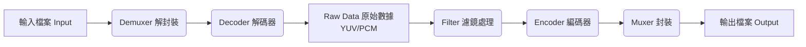

# 影像壓縮測試 (HEVC-AVC-JPEG-comparison)：H.265 vs H.264 vs JPEG
**實驗環境**：WSL環境，使用FFmpeg (Fast Forward MPEG) <br>
**實驗描述** : 採用 **「無損 PNG」** 作為原始圖片，並針對 **4K 高複雜度雜訊** 進行測試，展示 **H.265 vs H.264 vs JPEG**壓縮方法的壓縮率。

---
## FFmpeg 的運作邏輯 (The Pipeline)

**安裝方法** :
```bash
sudo apt update
sudo apt install ffmpeg
```
---
## 1. 實驗核心邏輯：

1.  **使用無損 PNG**：使用 PNG (Lossless) 作為原始圖片。

2.  **使用 4K 高雜訊圖進行壓力測試**：使用碎形幾何 (Mandelbrot) 疊加高強度雜訊。<br> 設計一個「無規律、高細節」的畫面能最大程度展現 H.264 與 H.265 壓縮完結果的差異。

---

## 2. 實驗步驟與指令說明


### 第一步：產生壓力測試用的母帶

```bash
ffmpeg -y -f lavfi -i mandelbrot=size=3840x2160 -vf "noise=alls=50:allf=t+u" -frames:v 1 source.png
```

**功能**：憑空算出一張 4K 解析度、充滿雜訊的碎形幾何圖，存成無損 PNG 圖片。這是所有實驗的基準（Source）。

* **`ffmpeg`**：啟動程式。
* **`-y`**：**Overwrite**。若檔案已存在，直接覆蓋不詢問。
* **`-f lavfi`**：**Format Libavfilter**。指定輸入來源不是檔案，而是 FFmpeg 內建的虛擬濾鏡引擎。
* **`-i mandelbrot=size=3840x2160`**：
    * 輸入源是 **曼德博集合 (Mandelbrot)** 碎形產生器。
    * 解析度設為 **3840x2160 (4K)**。碎形圖無限複雜，沒有大片純色，很難壓縮。


* **`-vf "noise=alls=50:allf=t+u"`**：**Video Filter (視訊濾鏡)**。
* **`noise`**：雜訊產生器。
* **`alls=50`**：強度設為 50（極強）。
* **`allf=t+u`**：雜訊模式設為時間性 (temporal) 且均勻分佈 (uniform)。這會讓畫面充滿亂數噪點，強迫編碼器保留細節，無法偷懶。


* **`-frames:v 1`**：只輸出 **1** 幀畫面就停止。
* **`source.png`**：輸出檔名。使用 **PNG** 代表無損壓縮。

---

### 第二步：JPEG 壓縮測試

```bash
ffmpeg -y -i source.png -q:v 2 output_jpeg.jpg
```

**功能**：將無損 PNG 圖片轉存為高品質的 JPEG 圖片，模擬傳統的圖片儲存方式。

* **`-i source_master.png`**：讀取無損 PNG 圖片。
* **`-q:v 2`**：**Quality (Video)**。
    * 針對 JPEG 格式，範圍通常是 1-31。
* **數值越小品質越高**。設為 **2** 代表極高品質 (Very High Quality)。


* **`output_jpeg.jpg`**：輸出為 JPEG 格式。

---

### 第三步：H.264 壓縮測試

```bash
ffmpeg -y -i source.png -c:v libx264 -crf 23 -pix_fmt yuv420p -frames:v 1 output_h264.mp4
```

**功能**：利用 H.264 影片編碼技術來壓縮這張圖。

* **`-c:v libx264`**：指定使用 **H.264 (AVC)** 編碼器。
* **`-crf 23`**：**Constant Rate Factor**。
    * H.264 的預設品質值。數值越小畫質越好，23 是平衡點。


* **`-pix_fmt yuv420p`**：**Pixel Format**。
    * 強制轉為 YUV 4:2:0 色彩抽樣。這是為了確保檔案在 Windows/QuickTime 等播放器上的相容性。


* **`-frames:v 1`**：只輸出一幀。雖然是影片檔，但只有一張靜態圖。
* **`output_h264.mp4`**：輸出為 MP4 容器。

---

### 第四步：H.265 壓縮測試

```bash
ffmpeg -y -i source.png -c:v libx265 -crf 28 -pix_fmt yuv420p -tag:v hvc1 -frames:v 1 output_h265.mp4
```

**功能**：利用更先進的 H.265 影片編碼技術來壓縮這張圖，預期檔案會最小。

* **`-c:v libx265`**：指定使用 **H.265 (HEVC)** 編碼器。
* **`-crf 28`**：
    * H.265 的預設品質值。
    * 注意：H.265 的 CRF 28 在視覺品質上約等同於 H.264 的 CRF 23，但壓縮效率更高。


* **`-tag:v hvc1`**：加入標籤以支援 Apple 裝置 (macOS/iOS) 預覽。
* **`-frames:v 1`**：同樣只輸出一幀，模擬 HEIC 圖片的概念。

---

### 第五步：查看結果

```bash
ls -lh source.png output_jpeg.jpg output_h264.mp4 output_h265.mp4
```

**功能**：列出這四個檔案的大小，驗證壓縮效率。

* **`ls`**：List，列出檔案。
* **`-l`**：Long format，顯示詳細資訊（權限、擁有者、大小）。
* **`-h`**：**Human-readable**。將檔案大小顯示為人看懂的單位（如 KB, MB, GB），而不是位元組 (Bytes)。

---

## 3. 影像壓縮效率

| 編碼方式 | 檔案大小 | 節省空間 | 效率評價 |
| :--- | :--- | :--- | :--- |
| **PNG** (Source) | 22 MB | **原始圖片** | 無損 PNG 圖片，4K 高複雜度雜訊圖 |
| **JPEG** (Traditional) | 7.9 MB | **64.1%** | 效率最差。縮小約 2.8 倍，無法有效處理複雜雜訊。 |
| **H.264** (AVC) | 1.2 MB | **94.5%** | 表現優異。縮小約 18.3 倍，遠勝傳統圖片格式。 |
| **H.265** (HEVC) | **501 KB** | **97.8%** | **極致壓縮**。縮小約 45 倍，在相同畫質下展現強大的演算優勢。 |

* **原因**：H.265 擁有 **64x64 的編碼樹單元 (CTU)** 與更先進的濾波器 (Deblocking Filter)。在面對高雜訊時，它能更有效地分辨「哪些是雜訊可以模糊化」以及「哪些是結構需要保留」，從而大幅節省流量。
---

## 4. 技術 Q&A

### Q: 為什麼最後比較的是 .mp4 與 .jpg，而不是把大家都轉成 .jpg？

**A:** 因為 **格式即演算法**。

* `.jpg` 代表使用 JPEG 演算法。
* `.mp4` (在此實驗中) 代表使用 H.264/H.265 演算法。
* 如果將 H.265 的結果轉存為 `.jpg`，就等於**解壓縮後重新用 JPEG 演算法編碼**，這樣檔案會變回 JPEG 的大小，H.265 的壓縮優勢就會消失。我們要比的是「容器裡的內容大小」。

### Q: 這在現實世界有什麼應用？

**A:**  **HEIC (High Efficiency Image Coding) 格式 (iPhone)**：其實就是將上述步驟 3 的 H.265 數據，換個名字存成圖片。

* **WebP / AVIF (網頁)**：原理相同，利用影片編碼技術 (VP8/AV1) 來取代傳統 JPEG，讓網頁載入更快、流量更省。
---
## 5. 參考資料

* ***[FFmpeg 官方網站](https://trac.ffmpeg.org/)***
* ***[H.265/HEVC Video Encoding Guide](https://trac.ffmpeg.org/wiki/Encode/H.265)***
* ***[H.264 Video Encoding Guide](https://trac.ffmpeg.org/wiki/Encode/H.264)***
---
## 6. 額外補充
### 為什麼 H.265 是 HEIC 的核心？
### $$\text{HEIC (檔案)} = \text{HEIF (容器格式)} + \text{H.265 (壓縮編碼)}$$HEIF (High Efficiency Image File Format)：是由 MPEG 組織定義的一種「容器標準」。它像是一個信封或紙箱，規定了檔案檔頭怎麼寫、資料怎麼放。<br>H.265 (HEVC) (High Efficiency Video Coding)：是實際把圖片數據變小的「壓縮演算法」。

---
